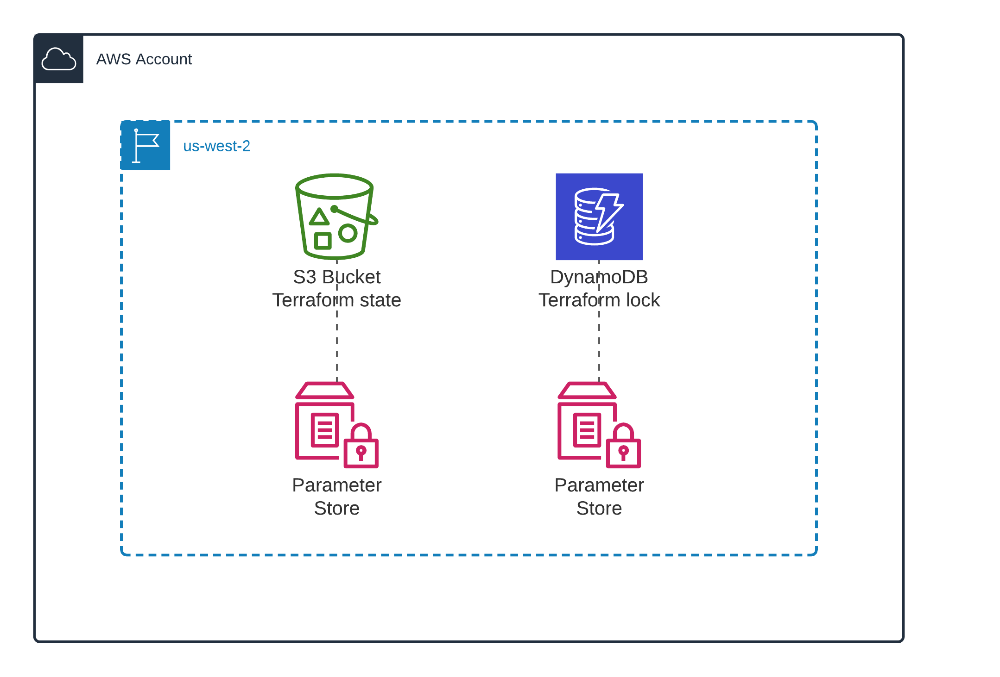

# Terraform remote state

This module deploys AWS infrastructure to store Terraform remote state in S3 bucket and lock Terraform execution in DynamoDB table.



## Deployment

```sh
terraform init
terraform plan
terraform apply -auto-approve
```

## Tier down

```sh
terraform destroy -auto-approve
```
