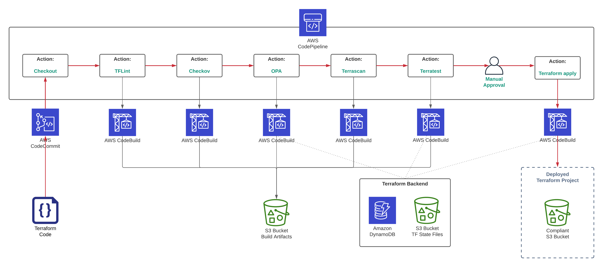

# AWS CodePipeline demo CICD pipeline for testing Terraform projects

This module deploys AWS CodePipeline, which uses tflint, Checkov, OPA, Terrascan, and Terratest to test Terraform modules.

Check out [How to use CodePipeline CICD pipeline to test Terraform](https://hands-on.cloud/how-to-use-codepipeline-cicd-pipeline-to-test-terraform/) article for more information.



## Deployment

Manually create SSM Parameter store parameter to store Infracost API key. For example:

* Key name: `/org/hands-on-cloud/terraform/infracost_api_key`
* Type: `SecureString`
* Description: `Infracost API key`
* Value: `YOUR_INFRACOST_API_KEY` (Use `infracost register` to get one)

By default, we're using the following prefix for SSM Parameter Store keys `/org/hands-on-cloud/terraform` (defined in [ssm_parameters](ssm_parameters.tf) file). 

```sh
terraform init
terraform plan
terraform apply -auto-approve
```

## Tier down

```sh
terraform destroy -auto-approve
```
